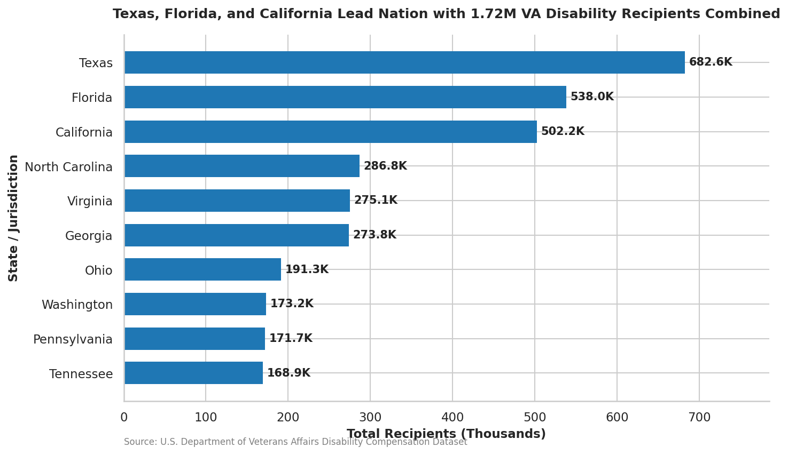
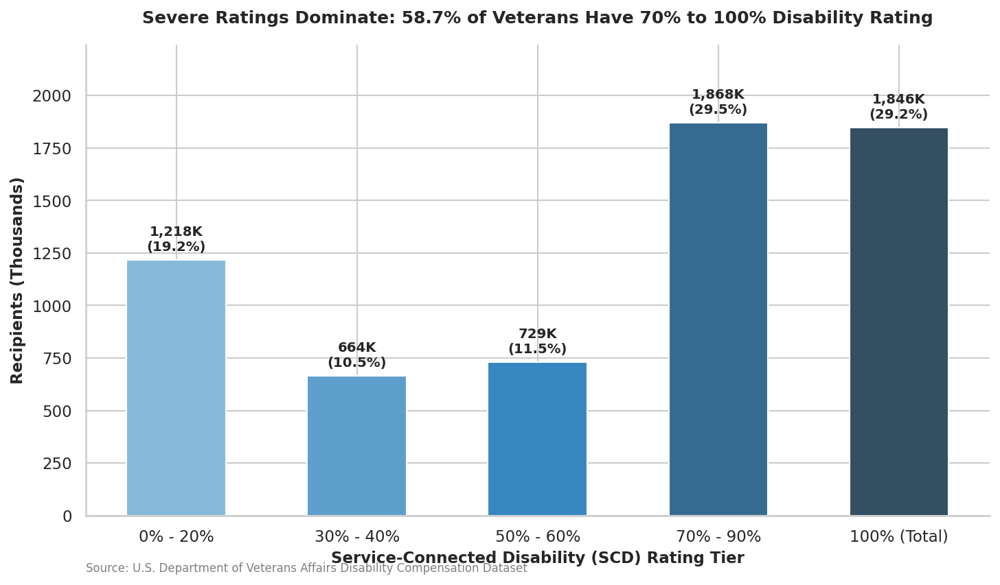
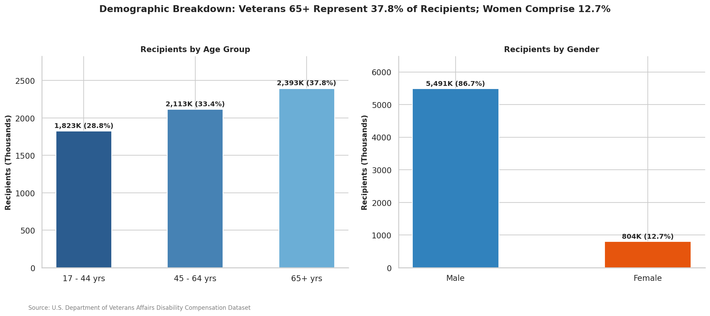

# U.S. Veterans Disability Compensation Analysis & Portfolio Showcase


An end-to-end data analysis and visualization repository exploring U.S. Department of Veterans Affairs (VA) disability compensation statistics across all 50 states, U.S. territories, age demographics, gender, and Service-Connected Disability (SCD) rating tiers.

---

## 📌 Executive Summary

This repository analyzes **6,331,627 U.S. veterans** receiving VA disability compensation. Key insights derived from county-level and state-level surveillance data include:

- **Geographic Concentration**: **Texas** (682,628 recipients), **Florida** (538,014), and **California** (502,173) lead the nation, accounting for **27.2% (1.72M)** of all benefit recipients nationwide.
- **Rating Severity Shift**: A significant **58.7%** of compensated veterans have a Service-Connected Disability (SCD) rating of **70% or higher** (29.5% at 70%–90%, and 29.2% at 100% total disability).
- **Aging Demographic**: Veterans aged **65 or older** represent the largest age demographic (**37.8%** / 2.39M recipients), followed by those aged **45–64** (**33.4%** / 2.11M) and **17–44** (**28.8%** / 1.82M).
- **Gender Breakdown**: Male veterans comprise **86.7%** (5.49M) of recipients, while female veterans account for **12.7%** (804,265).

---

## 📊 Key Data Visualizations

### 1. Geographic Distribution: Top 10 States
Texas, Florida, and California exhibit the highest veteran disability compensation volumes, followed by North Carolina, Virginia, and Georgia.



### 2. Service-Connected Disability Rating Severity
Over half of all compensated veterans are rated between 70% and 100% disability, underscoring significant healthcare and financial support requirements.



### 3. Demographic Profile (Age & Gender)
Aging veterans (65+) make up the largest recipient cohort, while younger cohorts (17–44) constitute nearly 29% as recent service members transition to civilian life.



---

## 📈 National Summary Data Table

| Category / Metric | Total Recipients | Percentage of National Total |
| :--- | :--- | :--- |
| **National Total** | **6,331,627** | **100.0%** |
| **SCD Rating: 0% – 20%** | 1,218,210 | 19.2% |
| **SCD Rating: 30% – 40%** | 663,882 | 10.5% |
| **SCD Rating: 50% – 60%** | 728,907 | 11.5% |
| **SCD Rating: 70% – 90%** | 1,868,474 | 29.5% |
| **SCD Rating: 100% (Total Disability)** | 1,845,855 | 29.2% |
| **Age: 17 – 44 years** | 1,823,031 | 28.8% |
| **Age: 45 – 64 years** | 2,112,779 | 33.4% |
| **Age: 65+ years** | 2,392,605 | 37.8% |
| **Male Veterans** | 5,490,962 | 86.7% |
| **Female Veterans** | 804,265 | 12.7% |

---

## 📂 Repository Structure

```text
va-disability-compensation-analysis/
├── README.md                            <-- Project documentation & portfolio summary
├── analyze_va_disability_data.py        <-- Automated Data Processing & Chart Generator
├── top_states_va_recipients.png        <-- Top 10 States Ranking Chart
├── va_disability_rating_severity.png    <-- Disability Rating Tier Breakdown Chart
└── va_disability_demographics.png       <-- Age & Gender Demographics Chart
```

---

## 🚀 Quickstart & Reproducibility

### Prerequisites
- Python 3.10+
- Pandas, Matplotlib, Seaborn

```bash
pip install pandas matplotlib seaborn
```

### Running the Analysis
To clean the raw dataset and re-generate all publication-quality charts:

```bash
python analyze_va_disability_data.py
```

---

## ✒️ Author & Portfolio Note
*Generated with Gemini Notebook. Data grounded in official U.S. Department of Veterans Affairs Disability Compensation surveillance records.*
